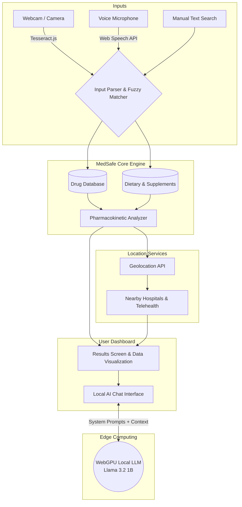

# MedSafe AI 🧬

**An offline-first, privacy-preserving clinical pharmacologist in your browser.**

MedSafe AI analyzes complex interactions between prescription medications, dietary supplements, and foods. By running optical character recognition (OCR) and a 1-Billion parameter Large Language Model (LLM) *entirely locally* via WebGPU, MedSafe AI guarantees zero latency, zero cloud costs, and 100% HIPAA-compliant patient privacy.

---

## 🏆 Hackathon Project Requirements

### 1. Clear Problem Identification
**The Problem:** Polypharmacy (taking multiple medications) leads to millions of adverse drug events (ADEs) annually. Current solutions either rely on hard-to-read medical jargon or send highly sensitive patient health data (PHI) to remote cloud servers (like OpenAI) for AI analysis, causing severe privacy violations. 

### 2. Innovative Approach or Solution
**The Solution:** MedSafe AI brings the hospital to the edge. It features an on-device AI system that reads your prescriptions via your laptop camera (OCR) and analyzes interactions locally. Users can chat dynamically with their results using a WebGPU-accelerated Local AI that doesn't rely on the cloud. We also include food and herbal supplements, bridging the gap between clinical drugs and dietary habits.

### 3. Technical Implementation
- **Frontend**: React + TypeScript + Vite. 
- **Styling**: TailwindCSS with Apple Siri-inspired dynamic HTML5 Canvas backgrounds.
- **Edge AI**: `@mlc-ai/web-llm` running **Llama-3.2-1B-Instruct** in the browser using WebGPU.
- **OCR Engine**: `Tesseract.js` for on-device image processing and text extraction.
- **Data Engine**: A synthetic graph-like database with over 490+ drugs, foods, and supplements and 170+ interaction pairs with severity mechanisms.

### 4. Usability and User Experience
- **Siri-like Aesthetics**: The app utilizes deep glassmorphism and a fluid, dynamic aurora background that reacts to the severity of the interactions (turning red for critical alerts).
- **Accessibility**: Users can input drugs via Text, Voice (Web Speech API), or Camera (Tesseract OCR). 
- **Actionable Outputs**: Instead of medical jargon, the AI provides plain-english summaries, emergency contacts based on geolocation, and online telehealth links.

### 5. Scalability and Feasibility
- **Zero Cloud Costs**: Because the AI inference and OCR processing happen on the user's hardware, the server infrastructure costs are essentially zero, making it infinitely scalable.
- **Privacy by Design**: Since no patient data leaves the device, regulatory and HIPAA compliance overhead is drastically reduced.

---

## 🧠 System Architecture



## 🚀 How to Run Locally

1. Clone the repository
2. Install dependencies:
   ```bash
   npm install
   ```
3. Start the Vite development server:
   ```bash
   npm run dev
   ```
4. Open your browser to `http://localhost:5173`. 
*(Note: To use the Local AI, you must use a WebGPU-compatible browser like Google Chrome or Microsoft Edge).*